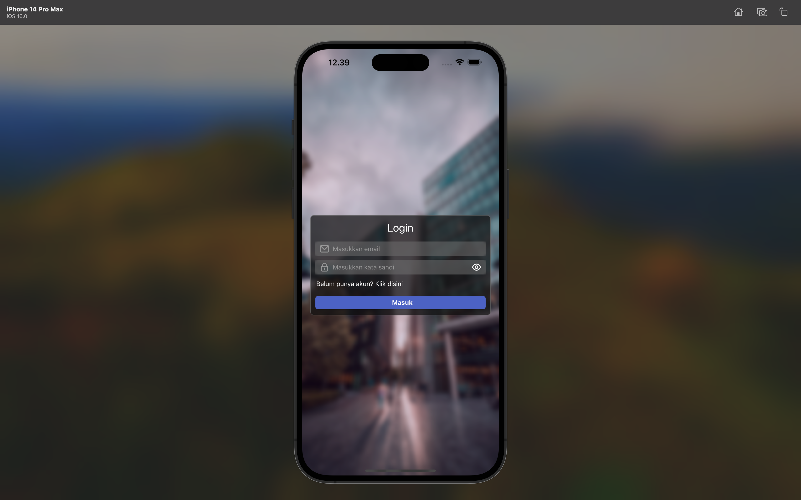
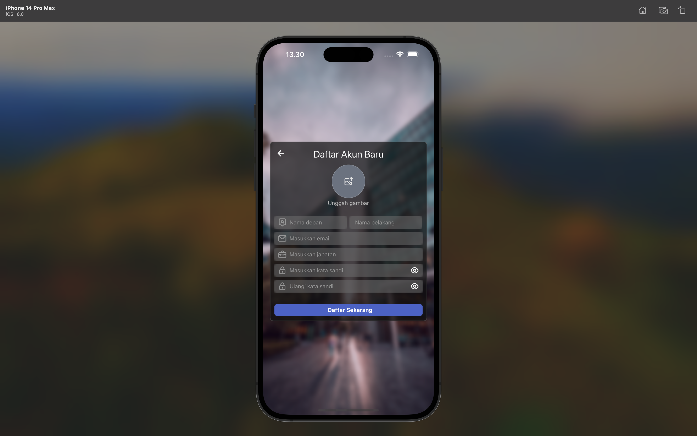
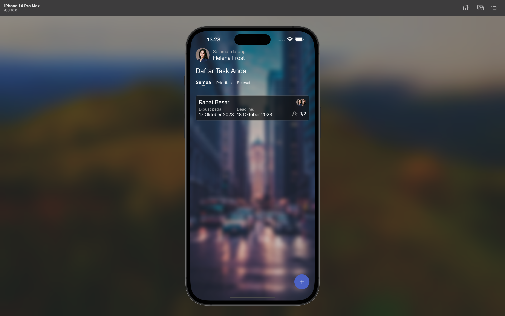
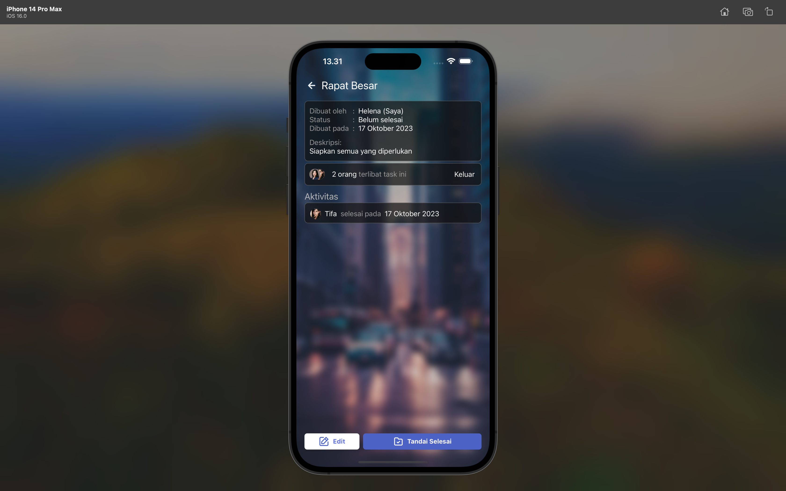
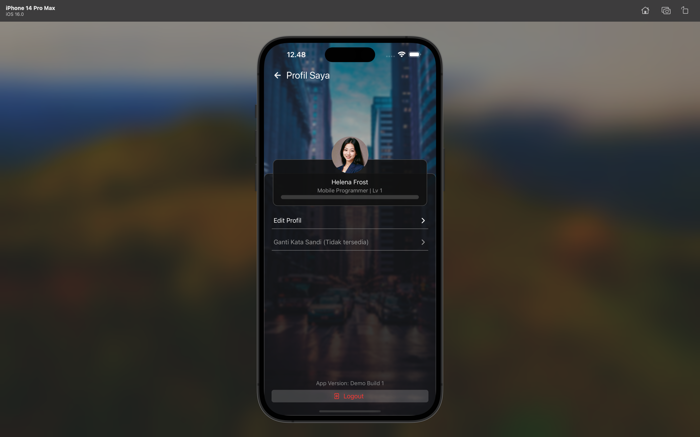

# Tasks Box

Tasks Box is a mobile app built with **React Native** and **Expo** designed to enhance task management and collaboration while adding a touch of gamification to keep users engaged. It leans on Firebase for the backend, ensuring seamless handling of authentication, database, and storage services.


## Table of Contents

- [Screenshots](#screenshots)
- [Demo](#demo)
- [Development Setup](#development-setup)
- [License](#license)
- [Stay Connected](#stay-connected)
- [External Links](#external-links)


## Screenshots

### Login Screen


### Register Screen


### Home Screen


### Task Screen


### Profile Screen



## Demo

You can download the pre-built APK of Tasks Box from the [**Releases**](https://github.com/adisatr7/tasks-box/releases) section to run it on your phone. As of right now, only Android devices are supported.

Choose the latest release and download the APK compatible with your Android device. After downloading, install the APK on your device and start using Tasks Box.


## Development Setup

If you want access to the source code, follow these steps to set up your development environment:

1. Clone this repository to your local machine.
```bash
git clone https://github.com/adisatr7/tasks-box.git
```

2. Open a terminal and navigate to the project's root directory.
```bash
cd tasks-box
```

3. Run the following command to install the required dependencies:

* If you use NPM:
```npm
npm install
```

* Or if you prefer to use Yarn:
```yarn
yarn install
```

4. Access the Firebase Console to create a new app.

5. Next, create a configuration file named env.ts in the project's root directory. Fill in the contents with your Firebase configuration details, resembling the structure below:
```ts
export default {
  API_KEY: "your_firebase_api_key",
  AUTH_DOMAIN: "your_app.firebaseapp.com",
  PROJECT_ID: "your_app_project_id",
  STORAGE_BUCKET: "your_app.appspot.com",
  MSG_SENDER_ID: "msg_sender_id",
  APP_ID: "your_firebase_app_id"
}
```
* **Note:** Replace `your_app` placeholders with the actual values associated with your Firebase application.

6. Run the app in development server.
```bash
npx expo start
```


## License

This project is licensed under the MIT License - see the [LICENSE.md](LICENSE.md) file for details.


## Stay Connected

For any inquiries, collaboration opportunities, or feedback, please feel free to reach out via email at: adisatr7@gmail.com

## External Links

* [**Figma design file**](https://www.figma.com/file/swJhshdqtw0FfQ8wCUSm32/lyrid-crud?type=design&node-id=0%3A1&mode=design&t=3YevdXdZ9IlGnQ3i-1) for this project
* [**Instagram**](https://www.instagram.com/raddox7/)
* [**LinkedIn**](https://www.linkedin.com/in/adisatr7/)